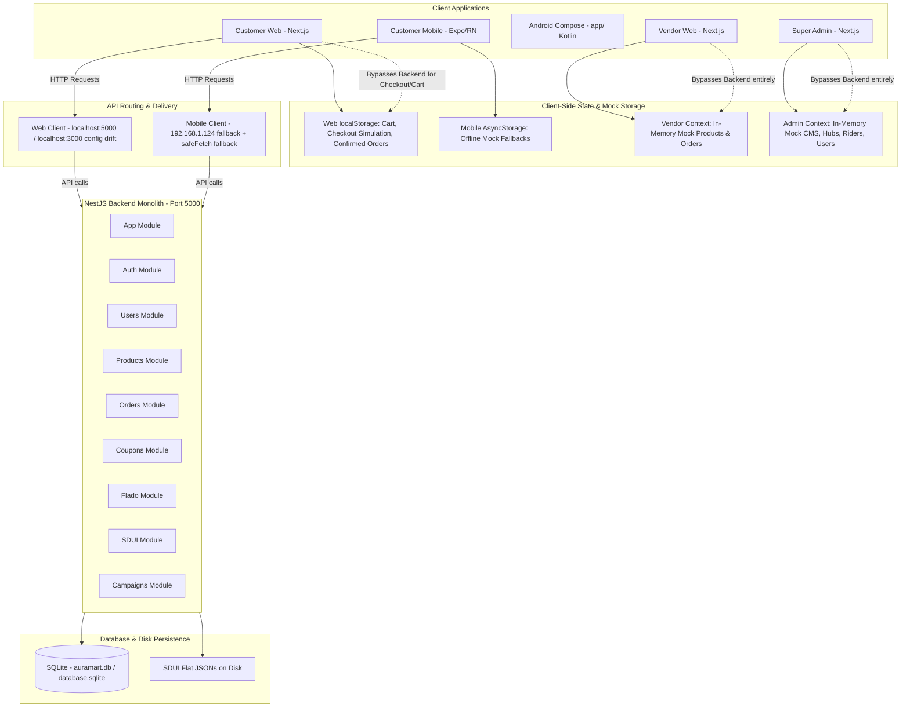
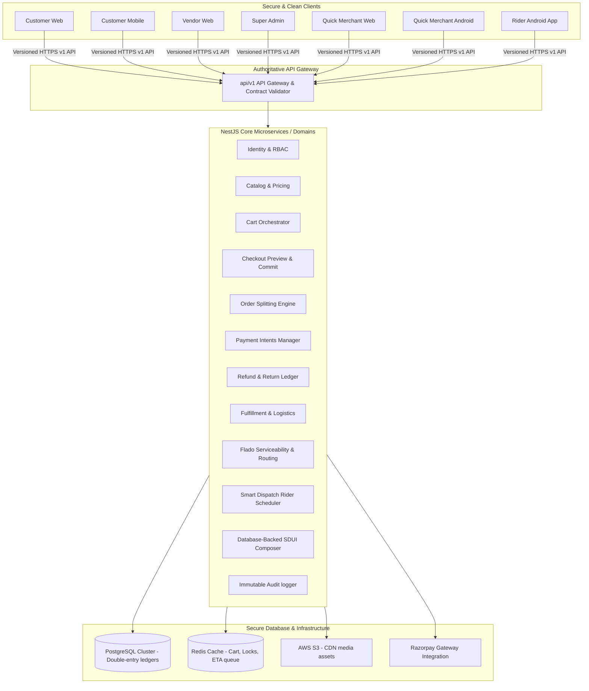

# ARCHITECTURE.md

## AuraMart + Flado — System Architecture Map

> **Audit Command:** CMD-002  
> **Type:** Read-Only Audit & Architecture Mapping  
> **Date:** 2026-08-05  

This document outlines the current state and target-state system architecture, boundaries, data flows, business logic duplicates, and security boundaries for the AuraMart E-commerce and Flado Quick-Commerce systems.

---

## 1. HIGH-LEVEL SYSTEM DIAGRAMS

### A. Current-State Architecture

Currently, the system is a partially integrated monolith where client applications are highly decoupled from backend reality, frequently relying on local mock state, localStorage, and inline simulation logic.



### B. Target-State Architecture

In the target state, all clients connect exclusively to an authoritative, secure API Gateway (`/api/v1`) using unified API contracts. The backend controls all business logic, financial calculations, state transitions, and persistent storage.



---

## 2. BACKEND MODULES & DATABASE ENTITIES

The NestJS backend monolith consists of 8 modules. The schema defines 26 TypeORM database entities.

### A. NestJS Modules
- **`AuthModule`**: User validation, JWT creation, OTP validation.
- **`UsersModule`**: Profiles, addresses, wishlists, and wallet balance views.
- **`ProductsModule`**: Category tree, audit logs, and products search/management.
- **`OrdersModule`**: Orders history retrieval, returns request, status change, and checkout validation.
- **`CouponsModule`**: Coupon code lookup and verification.
- **`FladoModule`**: Quick-commerce hubs, shops onboarding, riders availability, credit ledger (Udhaar), store hours, and subscriptions.
- **`SduiModule`**: Read/write layouts for Home, Flado, and Category landing pages.
- **`CampaignsModule`**: Flash sale listings and promotional image banners.

### B. Existing Database Entities
1. `User` (`users`)
2. `Address` (`addresses`)
3. `OtpToken` (`otp_tokens`)
4. `Vendor` (`vendors`)
5. `Category` (`categories`)
6. `Product` (`products`)
7. `Inventory` (`inventory`)
8. `Order` (`orders`)
9. `OrderItem` (`order_items`)
10. `Payment` (`payments`)
11. `Coupon` (`coupons`)
12. `UserWallet` (`user_wallets`)
13. `Darkstore` (`darkstores` - legacy placeholder)
14. `FladoShop` (`flado_shops`)
15. `FladoShopSubscription` (`flado_shop_subscriptions`)
16. `FladoShopCredit` (`flado_shop_credits`)
17. `FladoCreditTransaction` (`flado_credit_transactions`)
18. `ProductReview` (`product_reviews`)
19. `ReturnRequest` (`return_requests`)
20. `WishlistItem` (`user_wishlist`)
21. `FlashSale` (`flash_sales`)
22. `Banner` (`banners`)
23. `Rider` (`riders`)
24. `ShopHours` (`shop_hours`)
25. `LoyaltyTransaction` (`loyalty_transactions`)
26. `AuditLog` (`audit_logs`)

---

## 3. SURFACE ANALYSIS & ARCHITECTURAL GAPS

### A. Customer Web
- **Path**: `web/`
- **Stack**: Next.js 16 (App Router), Vanilla CSS Modules.
- **API Integration**: Hits `NEXT_PUBLIC_API_BASE_URL` if present, but hardcodes `http://localhost:5000` in `.env` and multiple page locations. It silently falls back to 15 static local files (`web/src/data/*.ts`) if backend requests fail.
- **Gaps**: 
  - Checkout is fully simulated (`web/src/app/checkout/page.tsx:184`). Order details are printed only to `localStorage` and a static confirmation screen is shown.
  - Cart state is computed and stored 100% locally in React context + `localStorage`.
  - Saved addresses list is statically hardcoded in `checkout/page.tsx:138` instead of utilizing the user address book API.

### B. Customer Mobile
- **Path**: `mobile/`
- **Stack**: Expo 56, React Native 0.85.3, Expo Router.
- **API Integration**: Automatically detects debugger host Uri via Expo Constants. Fallback defaults to hardcoded `192.168.1.124:5000`. Uses a custom `safeFetch` wrapper (`mobile/src/utils/api.ts:34`) that catches exceptions and silently returns local mock fallback data.
- **Gaps**: 
  - Cart operations, totals, and calculations are kept local in AsyncStorage.
  - Auth page (`mobile/src/app/auth.tsx`) hits wrong port `3000` and falls back to `mock_token_123` on network errors.
  - Silently falls back to local products if API returns an empty array.
  - Discards backend inventory levels, hardcoding `stock: 20` for all products during API mapping.

### C. Vendor Web
- **Path**: `vendor/`
- **Stack**: Next.js 16.
- **API Integration**: Login and register hit the backend, but the entire core dashboard (`vendor/src/app/dashboard/`) reads from `VendorContext.tsx`.
- **Gaps**: 
  - **100% Mock State**: The entire vendor portal operates in-memory. Product CRUD, orders view, settlements, payouts, and business info update write only to transient state seeded with hardcoded arrays.
  - Bypasses the functional NestJS seller APIs.

### D. Super Admin
- **Path**: `admin/`
- **Stack**: Next.js 16.
- **API Integration**: Disconnected from API. All sub-pages interact with `AdminContext.tsx`.
- **Gaps**:
  - **100% Mock State**: The admin overview metrics, product listings, vendor verification toggles, and user blocking are purely simulated in React state.
  - Analytics graphs are hardcoded SVG shapes.
  - CMS page builder edits static React configurations without calling SDUI endpoints.

### E. Quick-Commerce / Flado
- **Path**: `backend/src/flado/`
- **Stack**: NestJS, SQLite/TypeORM.
- **Gaps**:
  - **Location & Routing**: Stores are searched using simple Euclidean distance (`lat/lng` math) instead of proper serviceability polygons and road routing.
  - **ETA Engine**: Calculated statically (`flado.service.ts:390`) as a fixed 20-minute fallback.
  - **Credit System**: Shop owner credits, repayment, ledger view, and credit freeze endpoints are defined on the backend but have zero role or verification guards. Any caller can mutate balances by supplying IDs.

### F. Quick Merchant Web & Quick Merchant Android
- **Quick Merchant Web**: Currently non-existent. Merchant operations are partially simulated inside the customer mobile app under the route `mobile/src/app/flado/vendor.tsx` (a massive 107KB file containing in-memory merchant views).
- **Quick Merchant Android**: Missing standalone Kotlin client. Currently, a customer client Jetpack Compose project is located under `app/`, but no dedicated store/order manager exists.

### G. Audit Logging Architecture (CMD-008)
- **Append-only Audit Repository**: `AuditLog` entity captures `actorId`, `actorRole`, `resourceId`, `resourceType`, `vendorId`, `shopId`, `details`, `ipAddress`, `userAgent`, and `createdAt`.
- **Automated Sensitive Field Redaction**: `redactSensitiveFields()` recursively replaces passwords, JWTs, refresh tokens, OTPs, CVVs, and credentials with `"[REDACTED]"`.
- **Async Non-blocking Log Handler**: `AuditService.log()` runs asynchronously with defensive try/catch blocks ensuring audit failure never breaks core business transactions.
- **Role-Guarded Query Controller**: `GET /api/v1/admin/audit-logs` guarded by `@Roles(Role.SUPER_ADMIN, Role.OPERATIONS)`.
- **Wired System Triggers**: Authentication events (`AUTH_LOGIN_SUCCESS`, `AUTH_LOGIN_FAILED`, `AUTH_REGISTER`), order status changes & returns (`ORDER_STATUS_UPDATE`, `RETURN_REQUEST`, `RETURN_APPROVE`, `RETURN_REJECT`), and SDUI layout changes (`SDUI_LAYOUT_SAVE`).

---

## 4. DATA FLOWS & CORE PRIMITIVES

### A. Shared Primitives

Identity, catalog items, addresses, payment records, wallet balances, loyalty points, and CMS configuration are shared at the database schema layer. However, the client applications frequently duplicate these configurations locally or bypass the database.

### B. Checkout Data Flow (Current vs. Target)

#### Current Flow (Client-Driven Simulation):
```
Client (Cart Local State) 
  → Computes Totals & 18% GST (Local JS)
  → Selects Preset Address (Local String)
  → Simulates 2.5s Payment (setTimeout)
  → Customer Web: Generates Random ID locally, saves to localStorage, clears local cart.
  → Customer Mobile: Hits backend /orders (no validation), falls back to mock ID if offline.
```

#### Target Flow (Server-Authoritative Intent):
```
Client (Sends Cart ID + Address ID + Payment Method)
  → Backend validation (Checks Inventory Reservation, Active Store, Valid Address)
  → Pricing Engine (Calculates safe Decimal subtotal, dynamic Tax slab, Delivery fee)
  → Checkout Preview (Returns validated breakdown with Idempotency Key)
  → Payment Intent (Creates Razorpay Session with transaction lock)
  → Webhook Confirmation (Secures funds, converts intent to Confirmed Order, updates Ledger)
```

---

## 5. MARKETPLACE VS. QUICK FULFILLMENT

The system operates two completely separate fulfillment paths:

| Property | Marketplace E-commerce | Flado Quick-Commerce |
|---|---|---|
| **Inventory Source** | Distributed Vendor Warehouses | Hyperlocal Dark Stores / Local Hubs |
| **SLA / Timeline** | 2-5 business days | 10-20 minutes instant delivery |
| **Fulfillment Group** | Requires order splitting (multiple vendors) | Single local shop per basket |
| **Logistics** | Third-party shipping partners (Bluedart/Delhivery) | Dedicated local riders pool |
| **ETA Calculation** | Static calendar promise | Dynamic: pick queue + rider travel + prep time |
| **Substitution** | Cancellation or buyer refund | Real-time replacement selection at picking |

**Gap**: The backend `Order` model currently does not support order splitting. An order is processed as a single entity, making multi-vendor fulfillment impossible without corruption of inventory status.

---

## 6. BUSINESS LOGIC CONFLICTS & DUPLICATES

1. **GST / Tax calculation**: 
   - Customers web and mobile both calculate GST as `Math.round(subtotal * 0.18)` inside local context components. 
   - The backend `orders.service.ts:58` receives the final calculated total from the client and saves it without auditing, meaning clients can force custom pricing.
2. **Delivery Fee**: 
   - Web: Flat ₹40 if subtotal < ₹500. 
   - Mobile: Flat ₹40 if subtotal < ₹999.
   - Backend: Lacks delivery fee validation rules, blindly accepting client totals.
3. **Wallet balance deductions**:
   - `UserWallet.balance` is updated via `-=` in the Orders Service, while the Mobile client also deducts `rewardWalletBalance` locally in `checkout.tsx:56` by writing to `AsyncStorage`.
4. **Order ID generation**:
   - Web creates random `FLADO-XXXXXX` strings on checkout.
   - Mobile creates `ORD-XXXXXX` mocks.
   - Backend auto-increments SQLite primary keys.

---

## 7. SECURITY & TRUST BOUNDARIES

### A. CORS Vulnerability
`backend/src/main.ts` sets `origin: true`. This allows any external website to query user details and authenticate sessions if cookies/cors headers are exposed.

### B. OTP plain-text leak
`backend/src/auth/auth.service.ts` returns the generated verification OTP in the response JSON:
```typescript
return { success: true, message: 'OTP sent successfully', otp };
```
This enables third-party callers to bypass multi-factor authentication.

### C. IDOR (Insecure Direct Object Reference)
Most Flado and merchant endpoints accept IDs (e.g. `shopId`, `riderId`, `orderId`) in the HTTP request body or parameters without validating that the authenticated user owns the resource or holds the necessary role.

### D. Hardcoded JWT fallback
NestJS main.ts falls back to a default secret string when `JWT_SECRET` is absent:
```typescript
const secret = process.env.JWT_SECRET || 'super-secret-jwt-key-change-in-production';
```
This prevents proper fail-safe deployment behavior in staging and production.

### E. Idempotency & Retry Safety Architecture (CMD-009)
- **Database Unique Constraint as Final Authority**: Key claim uses an atomic `INSERT INTO idempotency_keys` catching unique constraint violations on `scopedKey` (`actorId:operation:key`).
- **State Machine Model**:
  - `PROCESSING`: Concurrent requests receive `409 IDEMPOTENCY_CONCURRENT_REQUEST`.
  - `COMPLETED`: Identical retries replay cached status code and response body; payload mismatches receive `409 IDEMPOTENCY_PAYLOAD_MISMATCH`.
  - `FAILED`: Ambiguous post-mutation failures lock state and return `409 IDEMPOTENCY_FAILED_STATE` on retry to prevent double mutation. Pre-mutation 4xx validation errors delete key to allow immediate user correction.
- **Canonical Request Fingerprinting**: SHA-256 hash of `METHOD:ROUTE:SORTED_QUERY:SORTED_PARAMS:SORTED_BODY`.
- **Authorization Precedence**: NestJS Auth guards (`JwtAuthGuard`, `RolesGuard`) run BEFORE `IdempotencyInterceptor`.

---

## 8. MAJOR ARCHITECTURE GAPS & ROADMAP

1. **Client-Side Authoritativeness**: Core calculations and database writes are delegated to clients. 
2. **Mock Persistence Isolation**: Mock fallbacks are baked into production client API layers rather than isolated in environment-specific configurations.
3. **Missing Product Variant Primitives**: Database lacks normalized variant records, storing JSON strings.
4. **Database-Backed SDUI**: CMS configurations are raw JSON files residing on the disk, making them transient and subject to data loss on container restarts.

### Remediation Plan:
- **CMD-003**: Centralize all base URLs and API configurations, removing local host and fallback IP addresses.
- **CMD-004**: Strip out all `safeFetch` mock fallbacks, client-generated IDs, and fake checkout processing delays.
- **CMD-005 & CMD-006**: Apply unified JWT authentication and Roles/Ownership guards to all backend controllers, sealing Flado and Merchant endpoints.
- **CMD-007**: Introduce `/api/v1` version prefix and schema-validated DTOs.
- **CMD-008**: Append-only production audit logging for security events and sensitive mutations.
- **CMD-009**: Database-atomic idempotency infrastructure with state machine and canonical fingerprinting for order and financial mutations.
- **CMD-010**: Extract variants and SKUs into separate tables to enforce atomic inventory reservations (preventing overselling).

---
*CMD-002, CMD-003, CMD-004, CMD-005, CMD-006, CMD-007, CMD-008, CMD-009 Complete.*
