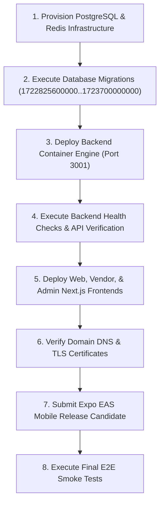

# AuraMart Commerce OS — Deployment Manifest (RELEASE-001)

**Release Candidate ID:** AuraMart RC-1  
**Document Purpose:** Step-by-step deployment sequence, verification steps, rollback strategy, and health check specifications for future production rollout (`DEPLOY-004B`).

---

## 1. Production Deployment Sequence



---

## 2. Step-by-Step Execution Plan

### Phase 1: Database & Cache Infrastructure
1. Provision PostgreSQL 15+ database cluster on Hostinger Cloud / Docker host.
2. Configure database connection string secrets (`DB_HOST`, `DB_USER`, `DB_PASSWORD`, `DB_NAME`).
3. Provision Redis cluster for cart and session token cache.

### Phase 2: Database Migration Execution
Execute migrations sequentially from `backend/src/database/migrations/`:
```bash
cd backend
DB_HOST=$PROD_DB_HOST DB_USER=$PROD_DB_USER DB_PASSWORD=$PROD_DB_PASS DB_NAME=$PROD_DB_NAME npm run migration:run
```
Verify zero remaining unapplied migrations:
```bash
npm run migration:show
```

### Phase 3: Backend API Container Deployment
1. Build production Docker container:
   ```bash
   docker build -t auramart-backend:rc-1 ./backend
   ```
2. Start NestJS container with production environment secrets configured in `docs/ENVIRONMENT_VARIABLES.md`.
3. Verify backend readiness probe:
   ```bash
   curl -f http://localhost:3001/api/v1/health
   ```

### Phase 4: Frontend Web Surfaces Deployment
1. **Customer Web:** Build & deploy Next.js bundle with `NEXT_PUBLIC_ENABLE_DEMO_FIXTURES=false`.
2. **Vendor Portal:** Build & deploy Next.js bundle with `NEXT_PUBLIC_ENABLE_DEMO_FIXTURES=false`.
3. **Admin Platform:** Build & deploy Next.js bundle with `NEXT_PUBLIC_ENABLE_DEMO_FIXTURES=false`.

### Phase 5: Mobile App Build & Release
1. Submit production Expo EAS build profile:
   ```bash
   cd mobile
   eas build --platform all --profile production
   ```
2. Publish OTA updates or submit to App Store / Google Play Console.

---

## 3. Smoke Test Verification Suite

| Test Target | Endpoint / Command | Expected Result |
|-------------|--------------------|-----------------|
| **Backend Health** | `GET /api/v1/health` | HTTP 200 `{"status":"ok"}` |
| **Catalog API** | `GET /api/v1/products` | HTTP 200 returning server-authoritative products |
| **Flado Serviceability** | `POST /api/v1/flado/serviceability` | HTTP 200 returning darkstore availability |
| **Brands API** | `GET /api/v1/brands` | HTTP 200 returning brand taxonomy |
| **Customer Web** | `GET https://auramart.com/` | HTTP 200 rendering pre-rendered homepage |
| **Vendor Portal** | `GET https://vendor.auramart.com/` | HTTP 200 rendering vendor dashboard |
| **Admin Platform** | `GET https://admin.auramart.com/` | HTTP 200 rendering admin dashboard |

---

## 4. Rollback Plan

If a critical failure occurs during deployment:
1. **Frontend Rollback:** Revert CDN / Next.js hosting pointer to previous deployment release tag.
2. **Backend Rollback:** Revert container image tag to previous stable image tag (`auramart-backend:previous`).
3. **Database Migration Rollback:** Execute migration rollback if required:
   ```bash
   cd backend
   npm run migration:revert
   ```
